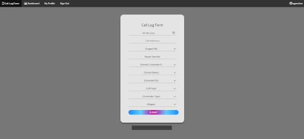

Platform I created in NodeJS, runnning a webserver on port 3000.

1. Home
This section allows the user to fill a form and then inserts the data in the msAccess database.

2. Dashboard

It reads data off a msAccess database file and pulls out statistics which are passed to an EJS generated html page. 
The html uses Chart.js to build the charts in the Dashboard section.

3. Profile
Allows a simple profile management like Password Reset and account type info.

4. Admin Panel
A hidden menu only for Users with Admin Access. Allows basic account management like reset user password, change access level and user addition/deletion.

The platform has a fully featured login system, password encryption and decryption via bcrypt.
Build via the MVC Framework.
Running on a local server residing on a separate VLAN.

